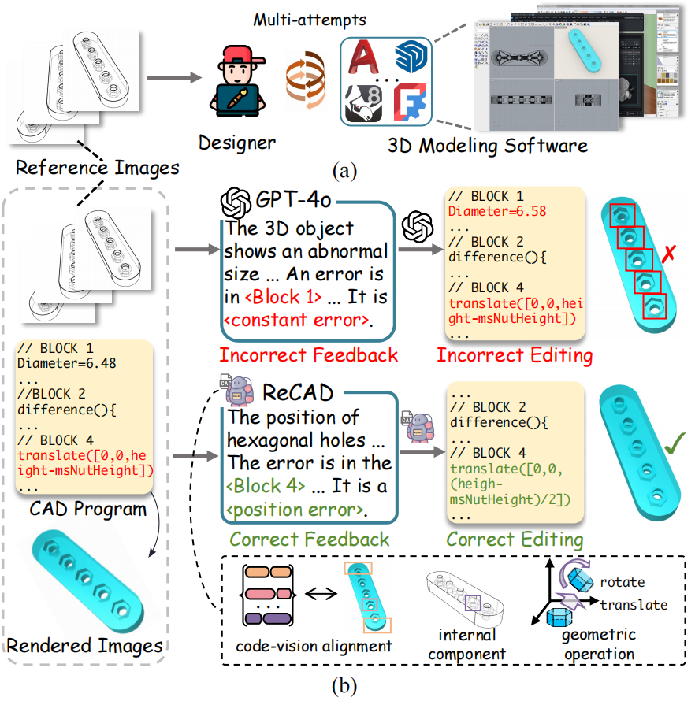

# CADReview :building_construction:
[]()

[**🌐 Homepage**](https://cgl-pro.github.io/cadreview/)  | [**📖 arXiv**]() | [**🤗 HuggingFace Dataset**]() 

This repo contains the codebase for our paper [CADReview: Automatically Reviewing CAD Programs with Error Detection and Correction](https://arxiv.org/abs/xxxx)

**🎉 ACL 2025 main**

## Introduction

We introduce the **CAD review** task, which aims to automatically detect and correct errors in CAD programs by comparing them with reference images. To support this task, we propose **ReCAD**, a multimodal large language model (MLLM)-based framework that generates feedback and edits code for accurate 3D reconstruction. We also present **CADReview**, a large-scale dataset with over 20,000 program–image pairs featuring diverse geometric structures and real-world error types. Our results show that ReCAD significantly outperforms existing models, offering a practical solution for AI-assisted CAD debugging and refinement.

```html
<div style="display: flex; gap: 2%; align-items: stretch;">
  <!-- Image 1: fixed height -->
  <div style="flex: 0 0 20%;">
    
  </div>
  
  <!-- Image 2: fills remaining space -->
  <div style="flex: 1;">
    
  </div>
</div>
```

## Training and Inference

1. Our training and inference are conducted using the [ms-swift](https://github.com/modelscope/ms-swift) framework. Environment configuration: `ms-swift >= 3.3`, `vllm >= 0.7.3`.
2. The alignment training for GCR and SGO can be found in:
   `./training_and_inference/alignment_gcr` and `./training_and_inference/alignment_sgo`.
3. Training for $\phi_1$ and $\phi_2$ can be found in:
   `./training_and_inference/feedback_gen` and `./training_and_inference/code_editor`.
4. The inference script can be found at:
   `./training_and_inference/inference.py`.


## Evaluation

Run `./evaluate/eval.sh` to perform evaluation.

